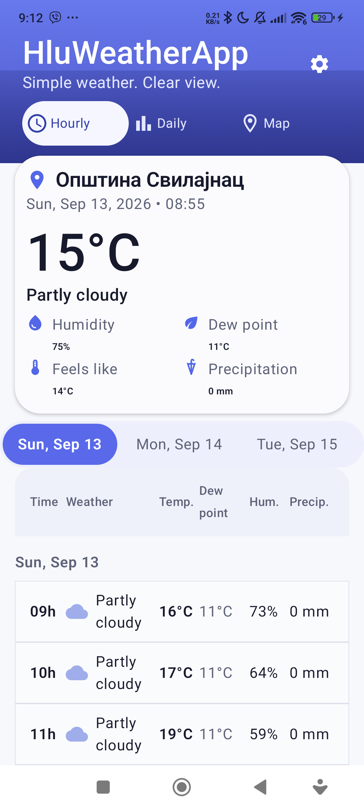
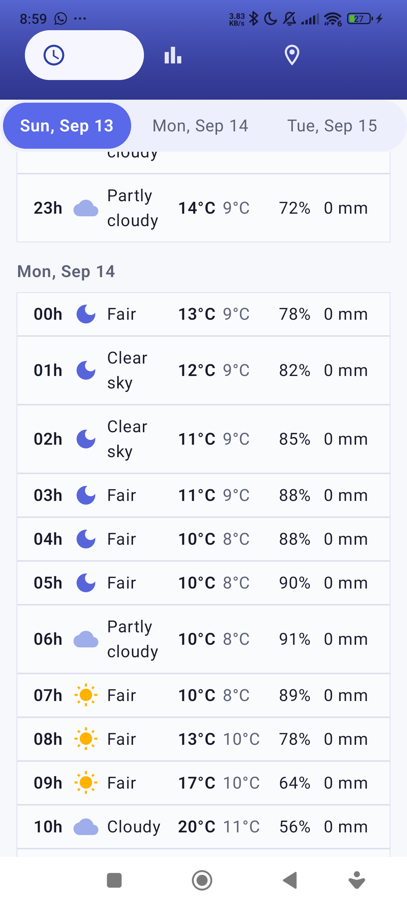
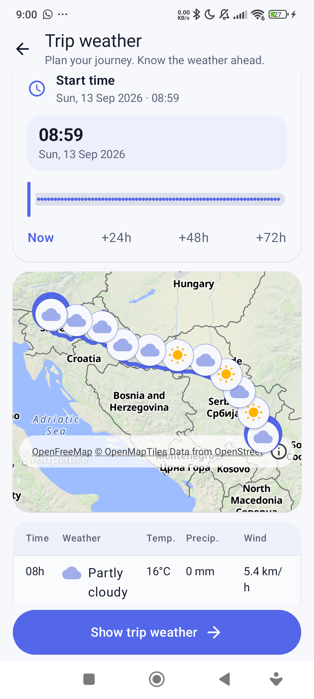
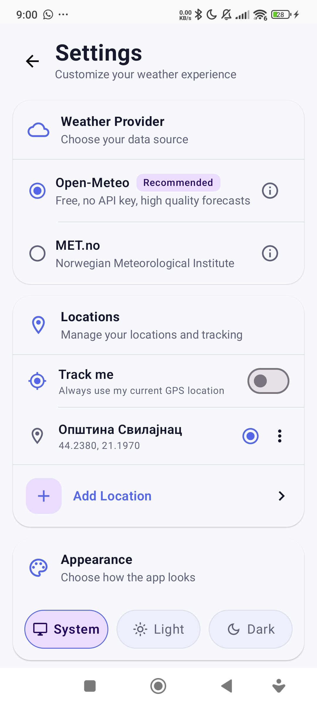

# HluWeatherApp

An Android weather app with hourly and daily forecasts, map-based weather switcher, trip weather along a route, multiple weather providers (https://open-meteo.com, https://met.no), and light/dark themes.

The main motivation for this app is easy access to dew point forecasts, which are hard to find in most apps, if they exist at all.

Another motivation is the default hourly table view with numbers, since that is how I prefer to view forecasts.

Then I also added a "Trip weather" feature, which helps me decide when to start my journey, since I can avoid bad weather (heavy rain, snow, very cold, or very hot conditions) during my drive.

## Screenshots

<table>
  <tr>
    <td></td>
    <td></td>
    <td></td>
    <td></td>
  </tr>
</table>
